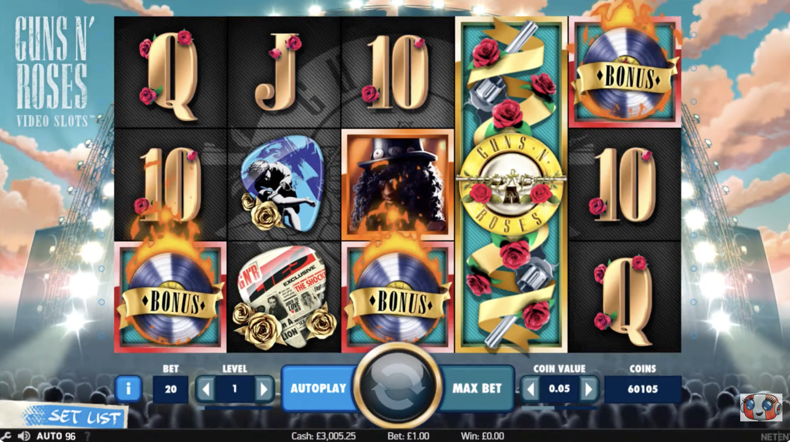
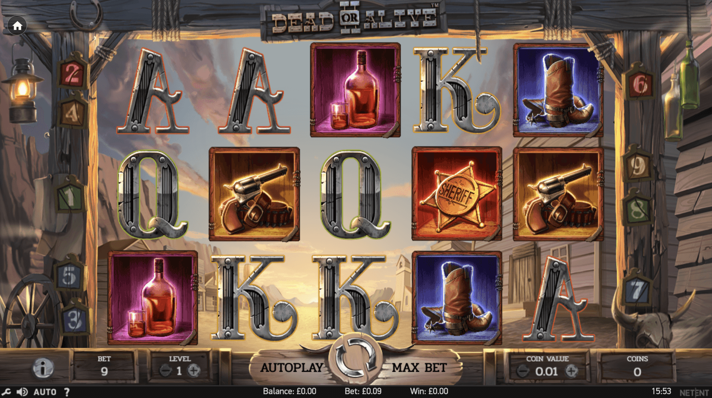
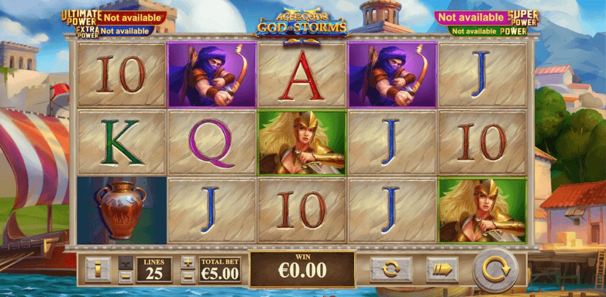

## Contributor Key

| Contributor | Contributions |
| --- | --- |
| Ophir | Starburst research (UI/UX, features, and review synthesis) |
| Shazi Bidarian | Rainbow Riches research (UI/UX, features, and review synthesis) |
| Aaron | Dead or Alive 2 research (UI/UX, features, and review synthesis) |
| Yang | Age of The Gods 2 research (UI/UX, features, and review synthesis) |
| Jeong | Mega Moolah research (theme, features, and overview notes) |
| Jeremy | Gates of Olympus research (maker/theme/features and review notes) |
| Aidan | Blood Suckers research (maker/theme/features and review notes) |
| Jiangxi | Mac app research: Xtreme Slots: Vegas Casino (reviews and features) |
| Stephanie | Mac app research: Cash Frenzy - Slots Casino (reviews and features) |
| Andrew Lopez | Sweet Bonanza research (UI/UX and review synthesis) |

---

## User

1. How to play different kinds of slot machine: https://www.cachecreek.com/how-to-play-slots

---

## The legal Trinity (for gambling)

1. Consideration: to play a game user should pay
2. Chance: the result should be 100% luck
3. Reward: by the result the user will be prized by Cash

---

## Rules for Slot Machines - Gambling

1. Random Number Generator: Have to prove the results are random & independent
2. Non-volatile Ram: in case of power failure, the machine must be able to restore the exact state of the last game, including credits and player status

---

## Rules for Slot Machines - Entertainment

1. Prize Limitation: The prize of the game should not be Cash (Real Money)
   - Merchandise only: Prizes must be physical items or tickets/ coupons
2. It should be skill based not luck
   - Chance-based: like slot machine if the user only presses the button and gets a prize, this is considered gambling
   - Skilled-based: A game where the player's reaction time, hand-eye coordination, or strategy significantly dictates the outcome.
3. Free Replay is accepted as Amusement

Red Flags (Features to Avoid)

- Knock-off switch: hidden buttons used by the maker to wipe credits
- Using classic gambling symbols (e.g. 777, Jackpot, etc)

---
# Research

**Citeria**

1. Features
2. Overview (3 good reviews+ 3 bad reviews)
3. UX/ UI (also add screenshot of each apps slot machine)

# Starburst: 

By Ophir

The UI of Starburst is colorful, simple, and easy to read. It uses a space-themed background with glowing stars, bright gemstone symbols, and clear buttons for spinning, changing bets, and autoplay. Most controls are placed at the bottom of the screen, while the reels stay centered and uncluttered.

The UX of Starburst is designed to feel smooth and beginner-friendly. Players can understand how to play almost immediately because there are very few complicated features or menus. Fast spins, frequent small wins, and exciting animations for expanding wilds make the game feel rewarding and easy to keep playing.

Features:

- **RTP Rate:** Starburst has an **RTP rate of 96.09%**, which means it’s slightly above average for an online slot.
- **Variance:** Starburst is a **low volatility game**. While this means you’ll receive frequent payouts, the maximum amount you can win is lower than other slots.
- **Bet Sizes:** The minimum bet you can make while playing Starburst is **$0.10**, making it accessible for low-budget players. The **maximum bet is $100**, offering a potential $50,000 max win.
- Traditional **5 x 3 reel system**
- “**Win Both Ways Pay System” - Its 10 paylines can be triggered from left to right and right to left, doubling the number of winning combinations on offer.**
- **Expanding Wilds:** As soon as a wild symbol lands on your screen, it extends to cover the entire reel, increasing your chances of finding a match.
- **Wilds:** The Starburst wild symbol can appear on reels 2, 3, and 4 of the gameboard, taking the place of any symbol.
- **Bonuses:** Starburst does not have a [bonus buy option](https://casinocanada.com/slots/bonus-buy-slot/).
- **Starburst Free Spins:** After finding a wild symbol, you get 1 re-spin with the three symbols still in place, with the potential for up to 3 re-spins if you find additional wilds.

Bad reviews (1 star):

## **My experience has been quite…**

My experience has been quite disappointing overall despite some positive first impressions. At the beginning the platform looks professional with a large game library and smooth interface. However once you start playing and especially when you try to withdraw the problems begin to appear. The biggest issue is withdrawals and payout limits. Many users report that withdrawing large winnings is extremely difficult, often limited to small daily amounts or delayed for unclear reasons. This creates the feeling that the platform is not designed for players to actually cash out significant wins.

## **You can only mute everything or have…**

You can only mute everything or have full sound. No way to turn down music but keep effects, or vice versa. Small UX thing but after long sessions it really matters. I left earlier than I would have because of it.

*no title*

I recently tried out Lizaro Casino, and I must say, it was a frustrating experience. Despite their claim of being "Beste Casino Zonder CRUKS," I encountered numerous issues that completely ruined my experience. The website interface is clunky, and navigating through it was more of a hassle than it should have been.

Depositing funds was a slow and tedious process, and when I tried to withdraw, I was hit with unnecessary delays. The customer support team was unresponsive and seemed uninterested in solving any of my issues. I had to wait hours for basic responses, and in the end, none of my concerns were addressed.

To top it all off, the bonuses and promotions they advertise are misleading. They come with unreasonable terms and conditions that aren't made clear upfront. I’ve had better experiences with other casinos that offer more transparency and reliable support.

Overall, I would advise anyone considering Lizaro Casino to steer clear. There are far better options out there.

Good reviews (5 stars, all were different languages? but this is translated):

# Swedish → English:
It’s easy to understand why Starburst…

It’s easy to understand why Starburst is so popular among Swedish players. NetEnt has truly succeeded with both the lighting and sound effects, creating a space adventure that still appeals to many slot enthusiasts.

# Combination of the Space Theme and…

The combination of the space theme and sparkling gemstones works very well. The highlight for me is when the BAR symbols land, because with the right luck they can give a really nice payout on the winning lines.

# Of All the Slot Machines I’ve Tried

Of all the slot machines I’ve tried, Starburst is the one I constantly return to. The feature that allows wins from both directions significantly improves both the experience and the winning possibilities.

# Rainbow Riches:

by Shazi Bidarian

The UI of Rainbow Riches is bright, colorful, and themed around Irish folklore. It uses rainbows, pots of gold, leprechauns, coins, and green landscapes to create a cheerful atmosphere. The reels stay in the center with simple controls for spin, bet size, and autoplay around them, while bonus features like Wishing Well, Pots of Gold, and Road to Riches have their own distinct visual screens.

The UX of Rainbow Riches is designed to be easy for beginners and fans of traditional slot machines. The game has simple controls, fast loading times, and straightforward mechanics, but adds variety through bonus rounds instead of relying on complex features. The cheerful sounds, smooth gameplay, and familiar UK pub-slot style make it feel accessible and nostalgic, especially for players who want something easy to understand.

## Features:

- **RTP Rate:** Rainbow Riches has an **RTP rate of around 95%**, which is about average for an online slot.
- **Variance:** Rainbow Riches is generally considered a **medium to high volatility game**. This means wins can be less frequent than in Starburst, but the bonus rounds can lead to larger payouts.
- **Bet Sizes:** Rainbow Riches can typically be played from around **$0.10-$0.20 minimum bets**, making it accessible for casual players. Some versions allow much larger bets for high-risk players.
- Traditional **5 x 3 reel system**
- **20 Paylines:** Rainbow Riches uses **20 paylines**, with wins usually paying from left to right across the reels.
- **Wild Symbol:** The gold coin acts as a wild symbol and can replace most regular symbols to help create winning combinations.
- **Road to Riches Bonus:** Landing 3 or more Road to Riches symbols triggers a bonus game where the player moves along a golden road for the chance to win multipliers and up to 500x their stake.
- **Wishing Well Bonus:** Landing 3 or more Wishing Well scatter symbols activates a pick-a-well bonus game where the player chooses one of several wells for a prize.
- **Pots of Gold Bonus:** Landing 3 or more Pots of Gold symbols triggers a feature where the player chooses from hidden pots to reveal prizes.
- **Max Win:** Rainbow Riches can pay up to around **500x the player’s total stake** in its bonus features.

## Bad reviews (1 star):
It seems that the majority of bad reviews are against the company more so than against the game, so there exists some bias outside of development.

**Review 1**

Back from a months break £60 on little wins.nothing big. No bonuses whatsoever. The amount of no wins spins is shocking. Back on a 2 week break for me. [Used.to](http://used.to/) be a rwally.good site now just takes all the time. [Impossible.to](http://impossible.to/) build.let alone withdraw. Shame used to like the pick n mix game but [since.it](http://since.it/) was "upgraded" just awful now.

**Review 2**

Scam company, if you have deposited money PLEASE dispute this immediately with your bank. If you want to withdraw money they request photos of your ID, Bank statements, bank cards and a photo standing outside of your house with a piece of paper showing todays date. They refuse to allow you to withdraw without submitting this. Do not hand over this information to them, I asked how they processed my data, who the data controllers were, who provides the verification service and what happens to my data once verified, they were unable to answer any of these questions.

**Review 3**

My game crashed several times while playing took my money but didn't stop spinning. Half the wins didn't add to my account. Wouldn't bother with this casino again. Totally rubbish.

# Good reviews (5 stars):

**Review 1**

Fun games with fast withdrawal

I actually won the mega blast pot £1500 it was in my bank within the hour .

You opt in before you play a game couldn’t believe it when I won the mega.

**Review 2**

Really good customer service. Had a problem verifying my account and a agent sorted it out within minutes so I could withdraw my big win

**Review 3**

I can only praise this company. I have played their Slingo games and won on them. The win money has been deposited in my bank account after a couple of days. I can only speak as I find and have found no problem with them. Long may it continue.

# Book of Ra Deluxe:

The UI of Book of Ra Deluxe is themed around ancient Egypt, with pyramids, explorers, scarabs, pharaohs, and treasure symbols filling the screen. The reels are centered in a traditional 5x3 layout, while the controls for betting, paylines, autoplay, and spinning are kept simple below the reels. The graphics are more old-school than modern slots, with darker gold and brown tones, simple animations, and a casino-style look that feels nostalgic rather than flashy.

The UX of Book of Ra Deluxe is focused on simple gameplay with a high-risk, high-reward feeling. Players can quickly understand the game because there are very few mechanics outside of paylines, wilds, and free spins. The most exciting moment comes when free spins are triggered and a random symbol becomes an expanding symbol across the reels, creating anticipation for larger wins. Despite the older visuals, the controls are straightforward and work well on both desktop and mobile.

## Features:

- **RTP Rate:** Book of Ra Deluxe has an **RTP rate of around 95.1%**, which is slightly below the industry average for online slots.
- **Variance:** Book of Ra Deluxe is a **high volatility game**. Wins are less frequent, but the free spins feature can lead to much larger payouts.
- **Bet Sizes:** The minimum bet can be as low as **$0.01-$0.10**, while the maximum bet can reach around **$90-$1000** depending on the casino version.
- Traditional **5 x 3 reel system**
- **10 Paylines:** Book of Ra Deluxe uses **10 paylines** that pay from left to right.
- **Wild and Scatter Symbol:** The Book of Ra symbol acts as both a wild and a scatter, meaning it can substitute for other symbols and also trigger bonus features.
- **Free Spins:** Landing 3 or more Book symbols triggers **10 free spins**, with the possibility to retrigger more spins during the feature.
- **Expanding Symbol Feature:** Before free spins begin, one random symbol is chosen as the special symbol. During the bonus round, whenever that symbol appears, it expands to cover the full reel.
- **Expanding Symbols Can Pay on Non-Adjacent Reels:** During free spins, the expanding symbol can create wins even when matching reels are not directly next to each other.
- **Gamble Feature:** After a winning spin, players can use the gamble feature to try doubling their winnings by guessing the color or suit of a card.
- **Max Win:** Book of Ra Deluxe has a maximum win potential of around **5,000x the player’s total stake**.

## Bad Reviews (1 Star):

Couldn’t copy paste, sorry guys

## Good Reviews (5 stars):

---

# Dead or Alive 2

by Aaron

## UI / UX

The UI of Dead or Alive 2 has a western cowboy theme. It uses a desert background with wooden textures, old buildings, and warm colors that match the Wild West style. The symbols include guns, boots, whiskey bottles, sheriff badges, and classic card letters.

The layout is simple and easy to understand. The reels are centered, and the controls are placed at the bottom, including spin, autoplay, bet, and coin value. The spin button is large and easy to click.

The UX feels slower and more focused compared to other slots. There are fewer animations and effects, which makes it easier to follow but less exciting visually. It is beginner-friendly, but some players may feel it is too simple or not engaging enough.

## Features

- RTP Rate: Around 96.8% (higher than average)
- Volatility: High volatility (big wins possible but less frequent)
- Reel System: 5 x 3 reels
- Free Spins Feature: Triggered by scatter symbols
- Expanding Wilds: Wild symbols can expand to cover full reels during free spins
- Multipliers: Can increase winnings during bonus rounds
- Autoplay: Available for automatic spins
- Adjustable Bets: Players can change bet size easily

## Bad Reviews (1 star)

1. In this part the dead is even deadlier than the first. In addition to the sound when dropping three skaters (yahhha) nothing more. Graphics too overdone
2. It is very hard to win. I played many spins but did not get any big rewards, which is frustrating.
    
    I've played this slot machine a lot over the last year, and i would say that the average to spins to get on the bonus is between 750 and 1500, there is then a high likely hood that you'll get nothing from the bonus too because of the highly volatile nature of the game.
    
    10 pay lines absolutely sucks too, sometimes I can see a pattern on the reels which should match but it doesn't because of the low amount of pay lines.
    
    I don't ever play this game anymore because the bonus mode barely ever triggers (my last session was over 3000 spins without 1 single bonus). This game is on my personal ban list now.
    
    I've had sessions of putting £3000 - £5000 into this game, playing several bonuses which yeild x12, x10 and x5.
    
    My advice is to avoid, there are much better games out there.
    
3. 
    - Monotonous gameplay
    - Rare nice wins
    - Impossibly difficult to win big (even above 100x)
    - In my two day session of 12k spins (all on second lowest bet € 0.2) I didn't have a single win above x100 including base and bonus rounds

## Good Reviews (5 stars)

1. Netent have managed to do what so many others failed to do and improve a game with it's sequel. The two new features are very good, got the multiplier to x51 with the first new feature (the less volatile one !) for 400x not as much luck with the other new feature 50x being the best. Didn't try the copy of the original feature.
2. I do like this game so much. Lets start off with the basic. Max Win is 100000x and yes its possible to be done. Also, the minimum bet is 0.09 cents which is really good for low bet players as well. I am indeed a fan of dead or alive. Its a game that continues to amaze me. Easy way to bet, design is old wild wild west and of course it gives 3 options to the player to choose after triggering the bonus. Very happy to be able to play it and trust me, one time this game will amaze you too.
3. The 3 bonus rounds and that you can choose one out of the 3 when you hit 3-5 scatters in the base game. I've tried them all multiple times over, and I'm having a tough time figuring out why anyone would want to pick anything other then the win often option. Every time a wild lands you get plus 1 to your spin count as well as the multiplier amount. You hit X16 you get another 5 spins added, which I hit about 90% of the time. The other 2 options I almost always walk away with less than a buck in winnings.

---

# Age of The Gods 2

By Yang

## UI / UX

The UI of Age of The Gods 2 uses a Greek mythology theme. It shows ancient buildings, statues, and gods, with soft colors and a clean background. The symbols include warriors, gods, vases, and classic card letters.

The layout is simple and balanced. The reels are centered, and the controls are placed at the bottom, including spin, bet, and win display. The buttons are clear and easy to understand.

The UX feels smooth and structured. There are not too many effects, which makes it easy to follow the game. It is beginner-friendly, but it may feel less exciting compared to more modern slot games with heavy animations.

## Features

- RTP Rate: Around 96% (average for online slots)
- Volatility: Medium volatility (balanced wins and risk)
- Reel System: 5 x 3 reels
- Paylines: 25 paylines
- Bonus Feature: Special symbols can trigger bonus rounds
- Free Spins: Available in bonus modes
- Progressive Jackpot: Connected to Age of The Gods jackpot system
- Autoplay: Available
- Adjustable Bets: Players can change bet size

## Bad Reviews (1 star)

1. The game feels too simple and not very exciting. There are not many animations or special effects.
2. The bonus features do not appear often. I played many times but did not get into bonus rounds.
3. The design looks a bit old compared to newer slot games. It does not feel very modern.

## Good Reviews (5 stars)

1. I like what Playtech has done with the Age of the Gods: God of Storms 2 slot machine. The game’s got wilds in the base game, the second of which triggers Wild Wind Respins that extend the reels to up to eight rows. You’ll increase your paylines and your chances to win a prize. And let’s not forget about the jackpot game that can trigger with any spin on the Age of the Gods series. Thumbs up! 
2. The game is easy to understand. The layout is simple and good for beginners.
3. The jackpot system is interesting. It gives players a chance to win bigger rewards.

# Mega Moolah

By Jeong

: couldn't find in the app store or web store (So, found the reviews of the game)

Maker: Microgaming

Theme: Africa Safari (Using a lot of animal symbols)

- Each animal has a character like graceful giraffes, mischievous monkeys, majestic lions → this game has its own story line.
-

## Feature:

- The progressive jackpot system, which offers the potential of some of the biggest wins possible on slots
  - User can choose between four progressive jackpots: Mini, Minor, Major and Mega. (Each offering players the chance to win a payout with every spin)
- Alongside jackpots, there are plenty of other bonus features
- Minimum bet ($0.01) to Max bet ($6.25)
- Mega Moolah slot has lower Return to Player (RTP), 88% to 90%
  - The wins may not be frequent, however the outcome is not bad
- Free spins with tripled wins
- 

- Overview: 3.9/5 (couldn't find the game, so couldn't see the real user reviews)
- UI: 

---

---

## User

1. How to play different kinds of slot machine: https://www.cachecreek.com/how-to-play-slots

---

## The legal Trinity (for gambling)

1. Consideration: to play a game user should pay
2. Chance: the result should be 100% luck
3. Reward: by the result the user will be prized by Cash

---

## Rules for Slot Machines - Gambling

1. Random Number Generator: Have to prove the results are random & independent
2. Non-volatile Ram: in case of power failure, the machine must be able to restore the exact state of the last game, including credits and player status

---

## Rules for Slot Machines - Entertainment

1. Prize Limitation: The prize of the game should not be Cash (Real Money)
   - Merchandise only: Prizes must be physical items or tickets/ coupons
2. It should be skill based not luck
   - Chance-based: like slot machine if the user only presses the button and gets a prize, this is considered gambling
   - Skilled-based: A game where the player's reaction time, hand-eye coordination, or strategy significantly dictates the outcome.
3. Free Replay is accepted as Amusement

Red Flags (Features to Avoid)

- Knock-off switch: hidden buttons used by the maker to wipe credits
- Using classic gambling symbols (e.g. 777, Jackpot, etc)

---
# Research

**Citeria**

1. Features
2. Overview (3 good reviews+ 3 bad reviews)
3. UX/ UI (also add screenshot of each apps slot machine)

# Starburst: 

By Ophir

The UI of Starburst is colorful, simple, and easy to read. It uses a space-themed background with glowing stars, bright gemstone symbols, and clear buttons for spinning, changing bets, and autoplay. Most controls are placed at the bottom of the screen, while the reels stay centered and uncluttered.

The UX of Starburst is designed to feel smooth and beginner-friendly. Players can understand how to play almost immediately because there are very few complicated features or menus. Fast spins, frequent small wins, and exciting animations for expanding wilds make the game feel rewarding and easy to keep playing.

Features:

- **RTP Rate:** Starburst has an **RTP rate of 96.09%**, which means it’s slightly above average for an online slot.
- **Variance:** Starburst is a **low volatility game**. While this means you’ll receive frequent payouts, the maximum amount you can win is lower than other slots.
- **Bet Sizes:** The minimum bet you can make while playing Starburst is **$0.10**, making it accessible for low-budget players. The **maximum bet is $100**, offering a potential $50,000 max win.
- Traditional **5 x 3 reel system**
- “**Win Both Ways Pay System” - Its 10 paylines can be triggered from left to right and right to left, doubling the number of winning combinations on offer.**
- **Expanding Wilds:** As soon as a wild symbol lands on your screen, it extends to cover the entire reel, increasing your chances of finding a match.
- **Wilds:** The Starburst wild symbol can appear on reels 2, 3, and 4 of the gameboard, taking the place of any symbol.
- **Bonuses:** Starburst does not have a [bonus buy option](https://casinocanada.com/slots/bonus-buy-slot/).
- **Starburst Free Spins:** After finding a wild symbol, you get 1 re-spin with the three symbols still in place, with the potential for up to 3 re-spins if you find additional wilds.

Bad reviews (1 star):

## **My experience has been quite…**

My experience has been quite disappointing overall despite some positive first impressions. At the beginning the platform looks professional with a large game library and smooth interface. However once you start playing and especially when you try to withdraw the problems begin to appear. The biggest issue is withdrawals and payout limits. Many users report that withdrawing large winnings is extremely difficult, often limited to small daily amounts or delayed for unclear reasons. This creates the feeling that the platform is not designed for players to actually cash out significant wins.

## **You can only mute everything or have…**

You can only mute everything or have full sound. No way to turn down music but keep effects, or vice versa. Small UX thing but after long sessions it really matters. I left earlier than I would have because of it.

*no title*

I recently tried out Lizaro Casino, and I must say, it was a frustrating experience. Despite their claim of being "Beste Casino Zonder CRUKS," I encountered numerous issues that completely ruined my experience. The website interface is clunky, and navigating through it was more of a hassle than it should have been.

Depositing funds was a slow and tedious process, and when I tried to withdraw, I was hit with unnecessary delays. The customer support team was unresponsive and seemed uninterested in solving any of my issues. I had to wait hours for basic responses, and in the end, none of my concerns were addressed.

To top it all off, the bonuses and promotions they advertise are misleading. They come with unreasonable terms and conditions that aren't made clear upfront. I’ve had better experiences with other casinos that offer more transparency and reliable support.

Overall, I would advise anyone considering Lizaro Casino to steer clear. There are far better options out there.

Good reviews (5 stars, all were different languages? but this is translated):

# Swedish → English:
It’s easy to understand why Starburst…

It’s easy to understand why Starburst is so popular among Swedish players. NetEnt has truly succeeded with both the lighting and sound effects, creating a space adventure that still appeals to many slot enthusiasts.

# Combination of the Space Theme and…

The combination of the space theme and sparkling gemstones works very well. The highlight for me is when the BAR symbols land, because with the right luck they can give a really nice payout on the winning lines.

# Of All the Slot Machines I’ve Tried

Of all the slot machines I’ve tried, Starburst is the one I constantly return to. The feature that allows wins from both directions significantly improves both the experience and the winning possibilities.

# Rainbow Riches:

by Shazi

The UI of Rainbow Riches is bright, colorful, and themed around Irish folklore. It uses rainbows, pots of gold, leprechauns, coins, and green landscapes to create a cheerful atmosphere. The reels stay in the center with simple controls for spin, bet size, and autoplay around them, while bonus features like Wishing Well, Pots of Gold, and Road to Riches have their own distinct visual screens.

The UX of Rainbow Riches is designed to be easy for beginners and fans of traditional slot machines. The game has simple controls, fast loading times, and straightforward mechanics, but adds variety through bonus rounds instead of relying on complex features. The cheerful sounds, smooth gameplay, and familiar UK pub-slot style make it feel accessible and nostalgic, especially for players who want something easy to understand.

## Features:

- **RTP Rate:** Rainbow Riches has an **RTP rate of around 95%**, which is about average for an online slot.
- **Variance:** Rainbow Riches is generally considered a **medium to high volatility game**. This means wins can be less frequent than in Starburst, but the bonus rounds can lead to larger payouts.
- **Bet Sizes:** Rainbow Riches can typically be played from around **$0.10-$0.20 minimum bets**, making it accessible for casual players. Some versions allow much larger bets for high-risk players.
- Traditional **5 x 3 reel system**
- **20 Paylines:** Rainbow Riches uses **20 paylines**, with wins usually paying from left to right across the reels.
- **Wild Symbol:** The gold coin acts as a wild symbol and can replace most regular symbols to help create winning combinations.
- **Road to Riches Bonus:** Landing 3 or more Road to Riches symbols triggers a bonus game where the player moves along a golden road for the chance to win multipliers and up to 500x their stake.
- **Wishing Well Bonus:** Landing 3 or more Wishing Well scatter symbols activates a pick-a-well bonus game where the player chooses one of several wells for a prize.
- **Pots of Gold Bonus:** Landing 3 or more Pots of Gold symbols triggers a feature where the player chooses from hidden pots to reveal prizes.
- **Max Win:** Rainbow Riches can pay up to around **500x the player’s total stake** in its bonus features.

## Bad reviews (1 star):
Quick warning, it seems that the majority of bad reviews are against the company more so than against the game…

## **Back from a months break £60 on little…**

Back from a months break £60 on little wins.nothing big. No bonuses whatsoever. The amount of no wins spins is shocking. Back on a 2 week break for me. [Used.to](http://used.to/) be a rwally.good site now just takes all the time. [Impossible.to](http://impossible.to/) build.let alone withdraw. Shame used to like the pick n mix game but [since.it](http://since.it/) was "upgraded" just awful now.

## **DISPUTE YOUR PAYMENTS IF YOU HAVE DEPOSIT3D WITH THIS COMPANY**

Scam company, if you have deposited money PLEASE dispute this immediately with your bank. If you want to withdraw money they request photos of your ID, Bank statements, bank cards and a photo standing outside of your house with a piece of paper showing todays date. They refuse to allow you to withdraw without submitting this. Do not hand over this information to them, I asked how they processed my data, who the data controllers were, who provides the verification service and what happens to my data once verified, they were unable to answer any of these questions.

## So bad

My game crashed several times while playing took my money but didn't stop spinning. Half the wins didn't add to my account. Wouldn't bother with this casino again. Totally rubbish.

# Good reviews (5 stars):

## **Fun games with fast withdrawal**

Fun games with fast withdrawal

I actually won the mega blast pot £1500 it was in my bank within the hour .

You opt in before you play a game couldn’t believe it when I won the mega.

## **Really good customer service**

Really good customer service. Had a problem verifying my account and a agent sorted it out within minutes so I could withdraw my big win

## **Great site**

I can only praise this company. I have played their Slingo games and won on them. The win money has been deposited in my bank account after a couple of days. I can only speak as I find and have found no problem with them. Long may it continue.

# Book of Ra Deluxe:

The UI of Book of Ra Deluxe is themed around ancient Egypt, with pyramids, explorers, scarabs, pharaohs, and treasure symbols filling the screen. The reels are centered in a traditional 5x3 layout, while the controls for betting, paylines, autoplay, and spinning are kept simple below the reels. The graphics are more old-school than modern slots, with darker gold and brown tones, simple animations, and a casino-style look that feels nostalgic rather than flashy.

The UX of Book of Ra Deluxe is focused on simple gameplay with a high-risk, high-reward feeling. Players can quickly understand the game because there are very few mechanics outside of paylines, wilds, and free spins. The most exciting moment comes when free spins are triggered and a random symbol becomes an expanding symbol across the reels, creating anticipation for larger wins. Despite the older visuals, the controls are straightforward and work well on both desktop and mobile.

## Features:

- **RTP Rate:** Book of Ra Deluxe has an **RTP rate of around 95.1%**, which is slightly below the industry average for online slots.
- **Variance:** Book of Ra Deluxe is a **high volatility game**. Wins are less frequent, but the free spins feature can lead to much larger payouts.
- **Bet Sizes:** The minimum bet can be as low as **$0.01-$0.10**, while the maximum bet can reach around **$90-$1000** depending on the casino version.
- Traditional **5 x 3 reel system**
- **10 Paylines:** Book of Ra Deluxe uses **10 paylines** that pay from left to right.
- **Wild and Scatter Symbol:** The Book of Ra symbol acts as both a wild and a scatter, meaning it can substitute for other symbols and also trigger bonus features.
- **Free Spins:** Landing 3 or more Book symbols triggers **10 free spins**, with the possibility to retrigger more spins during the feature.
- **Expanding Symbol Feature:** Before free spins begin, one random symbol is chosen as the special symbol. During the bonus round, whenever that symbol appears, it expands to cover the full reel.
- **Expanding Symbols Can Pay on Non-Adjacent Reels:** During free spins, the expanding symbol can create wins even when matching reels are not directly next to each other.
- **Gamble Feature:** After a winning spin, players can use the gamble feature to try doubling their winnings by guessing the color or suit of a card.
- **Max Win:** Book of Ra Deluxe has a maximum win potential of around **5,000x the player’s total stake**.

## Bad Reviews (1 Star):

Couldn’t copy paste, sorry guys

## Good Reviews (5 stars):

# Guns ‘n’ Roses

by Andrew

## UI / UX

The UI of Guns N’ Roses slot is very colorful and rock-themed. It uses a concert-style background with stage lights and a dark design that makes the symbols stand out. The symbols include guitars, roses, band members, and music-related icons, which clearly match the theme.

Most controls are placed at the bottom of the screen, including spin, autoplay, bet size, and coin value. The spin button is large and centered, making it easy to find. The layout is clear and not too crowded.

The UX feels smooth and engaging. The animations, fire effects, and bonus symbols make the game exciting. Players can quickly understand how to spin and adjust bets, but there are still many visual effects that may feel a little overwhelming for beginners.

## Features

- RTP Rate: Around 96% (average for online slots)
- Volatility: Medium to high volatility (bigger wins but less frequent)
- Reel System: 5 x 3 reels
- Bonus Feature: Bonus symbols (record icons) can trigger free spins or bonus rounds
- Wild Symbol: Substitutes for other symbols to create winning combinations
- Autoplay: Allows automatic spins
- Max Bet / Adjustable Bet: Players can change bet size easily
- Music Theme: Strong integration with Guns N’ Roses songs and visuals

## Bad Reviews (1 star)

1. Stupid trash ass game don’t even play unless you like donating cash
2. not recomended to play for money
3. The more of feature, the better? I can't agree with this one. Here we have a bunch of features and a lot of different possibilities during the bonus game AND the result is? Nothing. The best I have seen so far is 50x the bet with some perfect looking features but this is it. Big entertainment and besides this an averige game. The bonus round is very hard to get because of the bonus symbols appearing on reels 1, 3 and 5 only which minimized the possibility of getting it. You can consider yourself lucky after some 300 spins to see what happens. You might get some free spins or some other things. Mostly it cover the loses from 300 spins. For big FANS probably and people looking for entertainment and of course loving the music because this is the most important part apparently. I have to say this one: a slot like Minotaurus with 10 paylines only and ONE single feature but it is the perfect feature I have ever seen gives me after some 150 spins about 200x or even 450x the bet. With GnR you have to dream about this for a very long time. In my opinion this is a good slot for wagering because it does not seems to kill you and it covers the losses pretty often. But for winning? I doubt it very seriously.

## Good Reviews (5 stars)

1. I play this slot a lot of time and almost everytime he don't left me with nothing, Cool Guns N Roses music btw too is cool fun with this slot.
2. I really liked this slot. It doesn't seem to play the same way it did at first but I still give this one 5 stars and a tip of the bass guitar 🎸🎶 one of my all time favorites. I love plucking along to the tune of them sweet winning chords! -keithsr 🎹🎷🎺🎸
3. Awesome game full of very good features! I love this game all the way. Nothing beats the feeling when you fullfill the crowd meter n manage to find three fs symbols while filling it!

---

# Dead or Alive 2

by Aaron

## UI / UX

The UI of Dead or Alive 2 has a western cowboy theme. It uses a desert background with wooden textures, old buildings, and warm colors that match the Wild West style. The symbols include guns, boots, whiskey bottles, sheriff badges, and classic card letters.

The layout is simple and easy to understand. The reels are centered, and the controls are placed at the bottom, including spin, autoplay, bet, and coin value. The spin button is large and easy to click.

The UX feels slower and more focused compared to other slots. There are fewer animations and effects, which makes it easier to follow but less exciting visually. It is beginner-friendly, but some players may feel it is too simple or not engaging enough.

## Features

- RTP Rate: Around 96.8% (higher than average)
- Volatility: High volatility (big wins possible but less frequent)
- Reel System: 5 x 3 reels
- Free Spins Feature: Triggered by scatter symbols
- Expanding Wilds: Wild symbols can expand to cover full reels during free spins
- Multipliers: Can increase winnings during bonus rounds
- Autoplay: Available for automatic spins
- Adjustable Bets: Players can change bet size easily

## Bad Reviews (1 star)

1. In this part the dead is even deadlier than the first. In addition to the sound when dropping three skaters (yahhha) nothing more. Graphics too overdone
2. It is very hard to win. I played many spins but did not get any big rewards, which is frustrating.
    
    I've played this slot machine a lot over the last year, and i would say that the average to spins to get on the bonus is between 750 and 1500, there is then a high likely hood that you'll get nothing from the bonus too because of the highly volatile nature of the game.
    
    10 pay lines absolutely sucks too, sometimes I can see a pattern on the reels which should match but it doesn't because of the low amount of pay lines.
    
    I don't ever play this game anymore because the bonus mode barely ever triggers (my last session was over 3000 spins without 1 single bonus). This game is on my personal ban list now.
    
    I've had sessions of putting £3000 - £5000 into this game, playing several bonuses which yeild x12, x10 and x5.
    
    My advice is to avoid, there are much better games out there.
    
3. 
    - Monotonous gameplay
    - Rare nice wins
    - Impossibly difficult to win big (even above 100x)
    - In my two day session of 12k spins (all on second lowest bet € 0.2) I didn't have a single win above x100 including base and bonus rounds

## Good Reviews (5 stars)

1. Netent have managed to do what so many others failed to do and improve a game with it's sequel. The two new features are very good, got the multiplier to x51 with the first new feature (the less volatile one !) for 400x not as much luck with the other new feature 50x being the best. Didn't try the copy of the original feature.
2. I do like this game so much. Lets start off with the basic. Max Win is 100000x and yes its possible to be done. Also, the minimum bet is 0.09 cents which is really good for low bet players as well. I am indeed a fan of dead or alive. Its a game that continues to amaze me. Easy way to bet, design is old wild wild west and of course it gives 3 options to the player to choose after triggering the bonus. Very happy to be able to play it and trust me, one time this game will amaze you too.
3. The 3 bonus rounds and that you can choose one out of the 3 when you hit 3-5 scatters in the base game. I've tried them all multiple times over, and I'm having a tough time figuring out why anyone would want to pick anything other then the win often option. Every time a wild lands you get plus 1 to your spin count as well as the multiplier amount. You hit X16 you get another 5 spins added, which I hit about 90% of the time. The other 2 options I almost always walk away with less than a buck in winnings.

---

# Age of The Gods 2

By Yang

## UI / UX

The UI of Age of The Gods 2 uses a Greek mythology theme. It shows ancient buildings, statues, and gods, with soft colors and a clean background. The symbols include warriors, gods, vases, and classic card letters.

The layout is simple and balanced. The reels are centered, and the controls are placed at the bottom, including spin, bet, and win display. The buttons are clear and easy to understand.

The UX feels smooth and structured. There are not too many effects, which makes it easy to follow the game. It is beginner-friendly, but it may feel less exciting compared to more modern slot games with heavy animations.

## Features

- RTP Rate: Around 96% (average for online slots)
- Volatility: Medium volatility (balanced wins and risk)
- Reel System: 5 x 3 reels
- Paylines: 25 paylines
- Bonus Feature: Special symbols can trigger bonus rounds
- Free Spins: Available in bonus modes
- Progressive Jackpot: Connected to Age of The Gods jackpot system
- Autoplay: Available
- Adjustable Bets: Players can change bet size

## Bad Reviews (1 star)

1. The game feels too simple and not very exciting. There are not many animations or special effects.
2. The bonus features do not appear often. I played many times but did not get into bonus rounds.
3. The design looks a bit old compared to newer slot games. It does not feel very modern.

## Good Reviews (5 stars)

1. I like what Playtech has done with the Age of the Gods: God of Storms 2 slot machine. The game’s got wilds in the base game, the second of which triggers Wild Wind Respins that extend the reels to up to eight rows. You’ll increase your paylines and your chances to win a prize. And let’s not forget about the jackpot game that can trigger with any spin on the Age of the Gods series. Thumbs up! 
2. The game is easy to understand. The layout is simple and good for beginners.
3. The jackpot system is interesting. It gives players a chance to win bigger rewards.

# Mega Moolah

By Jeong

: couldn't find in the app store or web store (So, found the reviews of the game)

Maker: Microgaming

Theme: Africa Safari (Using a lot of animal symbols)

- Each animal has a character like graceful giraffes, mischievous monkeys, majestic lions → this game has its own story line.
-

## Feature:

- The progressive jackpot system, which offers the potential of some of the biggest wins possible on slots
  - User can choose between four progressive jackpots: Mini, Minor, Major and Mega. (Each offering players the chance to win a payout with every spin)
- Alongside jackpots, there are plenty of other bonus features
- Minimum bet ($0.01) to Max bet ($6.25)
- Mega Moolah slot has lower Return to Player (RTP), 88% to 90%
  - The wins may not be frequent, however the outcome is not bad
- Free spins with tripled wins
- 

- Overview: 3.9/5 (couldn't find the game, so couldn't see the real user reviews)
- UI: 

---

# Gates of Olympus

By Jeremy Lim

## UI / UX

The UI of Gates of Olympus uses a Greek mythology theme focused on Zeus and Mount Olympus. The background shows clouds, temples, and a sky setting, giving it a bright and divine look. Symbols include crowns, rings, chalices, hourglasses, and colorful gems.

Unlike traditional slots, the reels use a **6 x 5 grid system** instead of paylines, which makes the layout feel more modern and dynamic. The controls (spin, autoplay, bet size) are placed at the bottom and are simple to understand.

The UX is fast-paced and visually engaging. Instead of spinning reels stopping in place, the game uses a **tumble mechanic**, where winning symbols disappear and new ones fall into place. This creates chain reactions that feel rewarding and continuous. The multipliers from Zeus add excitement, but the game can feel volatile and unpredictable.

## Features

- **RTP Rate:** Around **96.5%** (slightly above average)
- **Volatility:** **High volatility** (less frequent wins, but higher potential payouts)
- **Grid System:** **6 x 5 reels (no traditional paylines)**
- **Pay Mechanic:** Wins occur when **8 or more matching symbols** land anywhere on the grid
- **Tumble Feature:** Winning symbols disappear and new symbols fall into place, allowing **multiple wins in one spin**
- **Multiplier Symbols:** Zeus can drop **multipliers (2x–500x)** that apply to the total tumble win
- **Free Spins Bonus:**
  - Triggered by landing **4 or more scatter symbols**
  - Awards **15 free spins**
  - Multipliers during free spins are **added together instead of resetting**, increasing win potential
- **Max Win:** Up to **5,000x the player’s total stake**
- **Bet Sizes:** Typically ranges from **$0.20 to $100 per spin**

## Bad Reviews (1 star)

1. “Extremely inconsistent. Long losing streaks with almost no base game wins.”
2. “Bonus rounds are very hard to trigger, and when they do, payouts can still be low.”
3. “Feels too dependent on luck with multipliers—without them, wins are weak.”

## Good Reviews (5 stars)

1. “The tumble feature makes every spin exciting, especially when combos keep chaining.”
2. “Multipliers during free spins can stack up to huge wins, which feels very rewarding.”
3. “Modern design and smooth gameplay make it one of the most engaging slot games.”
---

# Blood Suckers

By Aidan

Maker: NetEnt

Theme: Vampire Theme

Number of Reels: 5 Reels

RTP: 98%

Bet: Min ($0.01) to Max ($50)

- Feature:
  - Wild Symbols (The Vampire Bite)
    - Function: it substitutes for all other symbols except for the Scatter and Bonus symbols
    - Payout: it is the highest paying symbol in the game
  - Free Spins (The Vampire Bride)
    : Landing 3 or more scatter symbols (represented by the terrified vampire bride) triggers the Free Spins round
    - The 3x Multiplier: A key highlight of this feature is that all wins during the Free Spins round are automatically tripled
  - Bonus Game
    : Landing 3 or more bonus symbols (Hammer and Stake) on a consecutive payline starting from the leftmost reel
    - Pick and Click interactive feature: click on one of the coffins to open them
      - If the vampire is inside, it is slain, and awarded a cash prize
      - If bats fly out of the coffin, it means the coffin is empty. This ends the bonus round, and the player is returned to the main game
  - Uses chilling ambient sound — wind howling, crows, and eerie whispers
  - Can access with very low minimum bet, accessible for casual players or those testing a new strategy
  - Quick Spin
  - Auto play: customizable stop-loss limits

- Overview: 7.8/10
  - Good Reviews:
    - "very high RTP, compared to others"
    - "Great chance to win"
    - "you just play and did not lose much"
  - Bad Reviews:
    - "the lines are fixed thus there is no way to change how many lines you want to play to lower your stake per spin"
    - "Because the variance is low, you can't win a lot of money out of this game"
    - "The bonus game is really hard to get"

UI: 
- 

---

# Mac Apps (slot machine games)

#### Xtreme Slots: Vegas Casino (Category: Casino)

By Jiangxi

- Maker: Meme, Inc
- Over 1,500 reviews 4.5/5
  [Xtreme1](https://github.com/user-attachments/assets/c44ce91f-b1db-4c3f-bc17-8cc3b5c33899)

Bad Reviews:

1. "the company is far too aggressive trying to sell you additional coins. Each time the app is opened, multiple dialogs will pop up saying coins are on sale"
2. "not very many wins"
3. "Suddenly there's a lot less free coins and a lot less winning"

Good Reviews:

1. "Straight forward with interesting bonus and goals"
2. ???
   

- Feature
  

---

#### Cash Frenzy - Slots Casino (Category: Casino)

By Stephanie

- Maker: SpinX Games Limited
- Over 1,500 reviews 4.8/5

Good Reviews:

1. "Graphic is good"
2. "has a lot of different choices for slots"

Bad Reviews:

1. "can lose a lot of money in short time"
2. "Same old story, win at first then less and less as you play"
3. "Missions are unachievable in hopes that you make a purchase"

- Feature:
  1. Game variety: over 150 free slots
  2. Famous Casino Theme provided
  3. Rewards & Bonuses:
     - Welcome bonus to new user
     - Timer system: An exciting built-in timer that provides periodic rewards, encouraging players to return to the app frequently (a key retention strategy).
  4. User Experience
     - Portrait Mode: Optimized for mobile use, allowing players to navigate and spin easily with one hand
     - Includes special bonus rounds
  5. Accessibility & Engagement
     - Anytime, anywhere

---

# Blood Suckers

By Aidan

Maker: NetEnt

Theme: Vampire Theme

Number of Reels: 5 Reels

RTP: 98%

Bet: Min ($0.01) to Max ($50)

- Feature:
  - Wild Symbols (The Vampire Bite)
    - Function: it substitutes for all other symbols except for the Scatter and Bonus symbols
    - Payout: it is the highest paying symbol in the game
  - Free Spins (The Vampire Bride)
    : Landing 3 or more scatter symbols (represented by the terrified vampire bride) triggers the Free Spins round
    - The 3x Multiplier: A key highlight of this feature is that all wins during the Free Spins round are automatically tripled
  - Bonus Game
    : Landing 3 or more bonus symbols (Hammer and Stake) on a consecutive payline starting from the leftmost reel
    - Pick and Click interactive feature: click on one of the coffins to open them
      - If the vampire is inside, it is slain, and awarded a cash prize
      - If bats fly out of the coffin, it means the coffin is empty. This ends the bonus round, and the player is returned to the main game
  - Uses chilling ambient sound — wind howling, crows, and eerie whispers
  - Can access with very low minimum bet, accessible for casual players or those testing a new strategy
  - Quick Spin
  - Auto play: customizable stop-loss limits

- Overview: 7.8/10
  - Good Reviews:
    - "very high RTP, compared to others"
    - "Great chance to win"
    - "you just play and did not lose much"
  - Bad Reviews:
    - "the lines are fixed thus there is no way to change how many lines you want to play to lower your stake per spin"
    - "Because the variance is low, you can't win a lot of money out of this game"
    - "The bonus game is really hard to get"

UI: 
- 

---

# Mac Apps (slot machine games)

#### Xtreme Slots: Vegas Casino (Category: Casino)

By Jiangxi

- Maker: Meme, Inc
- Over 1,500 reviews 4.5/5
  [Xtreme1](https://github.com/user-attachments/assets/c44ce91f-b1db-4c3f-bc17-8cc3b5c33899)

Bad Reviews:

1. "the company is far too aggressive trying to sell you additional coins. Each time the app is opened, multiple dialogs will pop up saying coins are on sale"
2. "not very many wins"
3. "Suddenly there's a lot less free coins and a lot less winning"

Good Reviews:

1. "Straight forward with interesting bonus and goals"
2. ???
   

- Feature
  

---

#### Cash Frenzy - Slots Casino (Category: Casino)

By Stephanie

- Maker: SpinX Games Limited
- Over 1,500 reviews 4.8/5

Good Reviews:

1. "Graphic is good"
2. "has a lot of different choices for slots"

Bad Reviews:

1. "can lose a lot of money in short time"
2. "Same old story, win at first then less and less as you play"
3. "Missions are unachievable in hopes that you make a purchase"

- Feature:
  1. Game variety: over 150 free slots
  2. Famous Casino Theme provided
  3. Rewards & Bonuses:
     - Welcome bonus to new user
     - Timer system: An exciting built-in timer that provides periodic rewards, encouraging players to return to the app frequently (a key retention strategy).
  4. User Experience
     - Portrait Mode: Optimized for mobile use, allowing players to navigate and spin easily with one hand
     - Includes special bonus rounds
  5. Accessibility & Engagement
     - Anytime, anywhere

    
# Sweet Bonanza

By Andrew Lopez 

Maker: Pragmatic Play

Theme: Candy / Sweets

Reel System: 6 x 5 Grid

RTP: 96.51%

Volatility: High

## UI/UX Design 
- The interface of Sweet Bonanza is a masking high-risk game that is very colorful, using bright colors with a pastel-colored candyland background theme very similar to Candy Crush. The symbols in the game are fruits such as apples, plums, and bananas, which are depicted by high-value 3D candies. The user experience is built around keeping player momentum high, even during losing streaks. 

- Layout: 
   - The layout is a massive 6 x 5 grid that is in the center of the screen, which can be controlled by the player. Such controls include bet size, autoplay, and Ante-Bet toggle, which are kept at the bottom of the screen.

- Visual Clarity:
   - Because the game uses "Scatter Pays" (where 8 or more matching symbols anywhere on the screen trigger a win, rather than traditional left-to-right paylines), the symbols are designed to be distinct at a quick glance. There are no confusing payline overlays, making it incredibly easy for beginners to read the board.

 - The Tumble Feature (Cascading Reels):
    - When a winning cluster hits, the symbols pop and disappear, and new symbols fall into the empty spaces. This creates a chain reaction. The UX benefit here is that a single paid spin can result in multiple consecutive wins, making the player feel like they are getting "free" action and extending their playtime.

- Fast Resolution:
   - Unlike many high-volatility slots that use long, drawn-out animations for "near misses," Sweet Bonanza resolves spins very quickly. If a spin is a loser, the game immediately lets the player spin again, preventing frustration and keeping the pacing smooth.

- Audio Engineering:
   - The base game features a relaxing, upbeat soundtrack. However, the audio shifts dynamically. When the Free Spins feature is triggered, or when a massive Tumble sequence begins, the music builds to a crescendo to increase tension. The physical "pop" and "thud" of the candies disappearing and dropping also provides satisfying auditory feedback.

- The Multiplier Drop (Tension Building):
   - During the Free Spins round, "Rainbow Bomb" symbols drop onto the grid with multipliers ranging from 2x to 100x. The UX brilliance here is that the multiplier bomb sits on the screen while the tumbling wins happen, building massive anticipation before the final multiplied payout is calculated at the end of the tumble sequence.
  

## Good Reviews(Focused on UI/UX):
1. "The clean interface and smooth performance make the game enjoyable, with the cascading win system adding excitement. The sound and visuals complement each other, creating a clear and engaging experience."

2. "Every spin feels like it could turn into something massive, and the multiplier bombs during free spins are what keep me coming back. The scatter pay system makes it easy to follow along without overthinking paylines."

## Bad Reviews(Focused on UI/UX): 
1. "Because it is so highly volatile, the base game is mostly just dead spins. It feels flat until something meaningful connects, making long sessions feel monotonous and visually repetitive."

2. "The music gets incredibly repetitive after about ten minutes. While the cheerful tone fits the theme, I usually end up playing it on mute during longer sessions."
